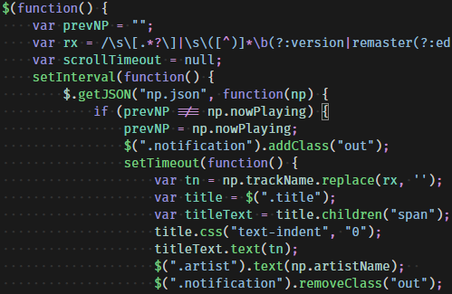

# Detox
Detox is a color scheme for Visual Studio Code. It uses hue and saturation to
provide semantic meaning. At a glance, it is easy to see how tokens are
different from each other. It's also quite colorful!

## Sample

## Hue
Hue is used to describe functionality. Constants are blue, objects are red, and variables are green. Similar constructs have closely related hues (such as classes and structs), but are different enough to notice.

## Saturation
Saturation describes mutability. Muted colors show static classes or immutable
variables, while bright colors show dynamic values. Just like a poisonous frog,
bright colors mean to be cautious!

## License
Detox is released under the permissive [ISC License](LICENSE).